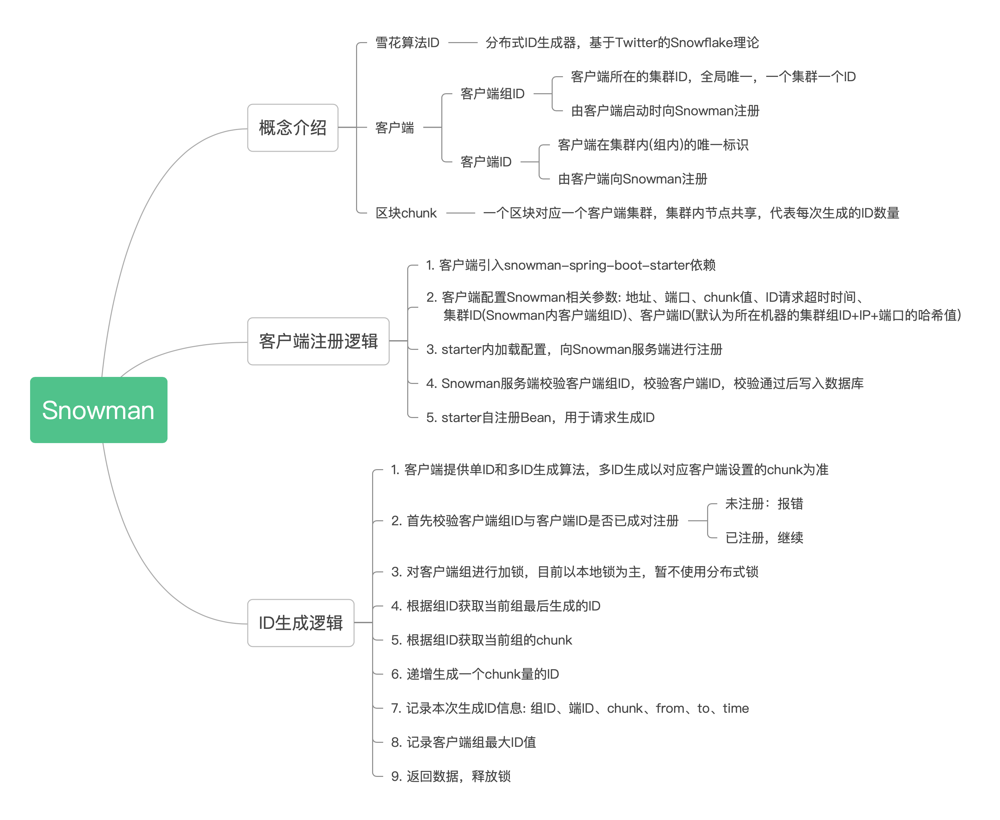

# snowman
snowflake（分布式ID生成器），基于Twitter的Snowflake理论


支持客户端分组按块（chunk）生成算法，当前支持的算法包括UUID、DIGIT递增顺序号、SNOWFLAKE（雪花算法）




## 项目说明

- ***JDK 版本要求: `JDK8+`*** 

- 支持的后端
  - MySQL


## 核心概念
区块chunk- 一个区块对应一个客户端集群，集群内节点共享，代表每次生成的ID数量


## 使用方法

客户端引入依赖
```xml
<dependency>
    <groupId>cc.kevinlu</groupId>
    <artifactId>snowman-spring-boot-starter</artifactId>
    <version>最新版本</version>
</dependency>
```
开启配置(Nacos)
```yaml
snowman:
  prop:
    name: springcloud-nacos
    chunk: 25
    mode: uuid
    group-id: springcloud-nacos
    server-id: nacos-1
```
开启配置(spring-boot)
```properties
snowman.prop.name=springboot
snowman.prop.group-id=springboot
snowman.prop.server-id=1
server.port=8081
```
使用
 ```java
import cc.kevinlu.snow.autoconfigure.SnowmanClient;

@RestController
public class TestController {

    @Resource
    private SnowmanClient snowmanClient;

    @RequestMapping(value = "/index")
    public List<Object> query() {
        return snowmanClient.generateSnowId();
    }
}
 ```
> `maven`依赖等详细配置请查看[examples](https://github.com/chuanyichuan/snowman-example)目录下的演示项目

## 开发计划
### v1.0.0  分支： main
 - [X] 支持Digit ID 生成算法
 - [X] 支持Snowflake ID生成算法
 - [X] 支持UUID 生成算法
 - [X] 构建snowman-spring-boot-starter实现自动配置
 - [X] 支持高可用集群部署
 - [X] 支持ID预生成，优化每次请求效率，提升性能
 - [X] 加入任务异步处理，降低服务队系统资源的影响
 - [X] 优化Snowflake时钟同步，使用Redis时钟做同步
 - [X] Web容器由Tomcat更改为Undertow 提升吞吐量
 - [X] 加入日志链路追踪MDC

### v1.0.1  分支： v1.0.1
 - [ ] 历史记录支持分表，缓解数据量过大导致的操作性能问题
 - [ ] 使用Redis控制定期任务执行节点

## 贡献指南

 代码要求：
  - 统一风格，包含注释、代码缩进等与本项目保持一致
  - 保持代码整洁，比如注释掉的代码块等垃圾代码应该删除
  - 严格控制外部依赖，如果没有必要，请不要引入外部依赖
  - 请在类注释中保留你的作者信息，请不要害羞


